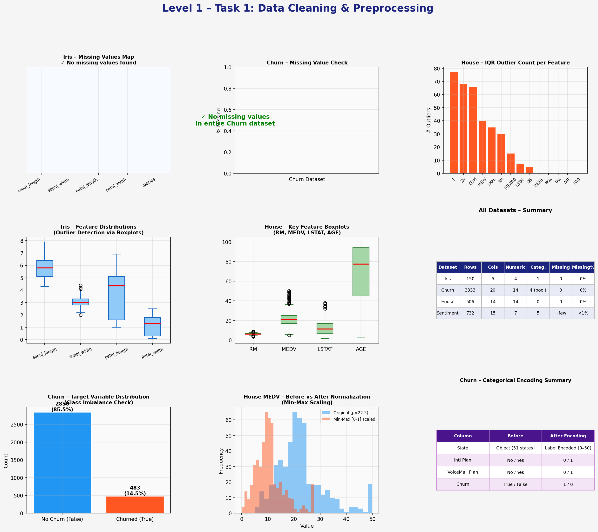
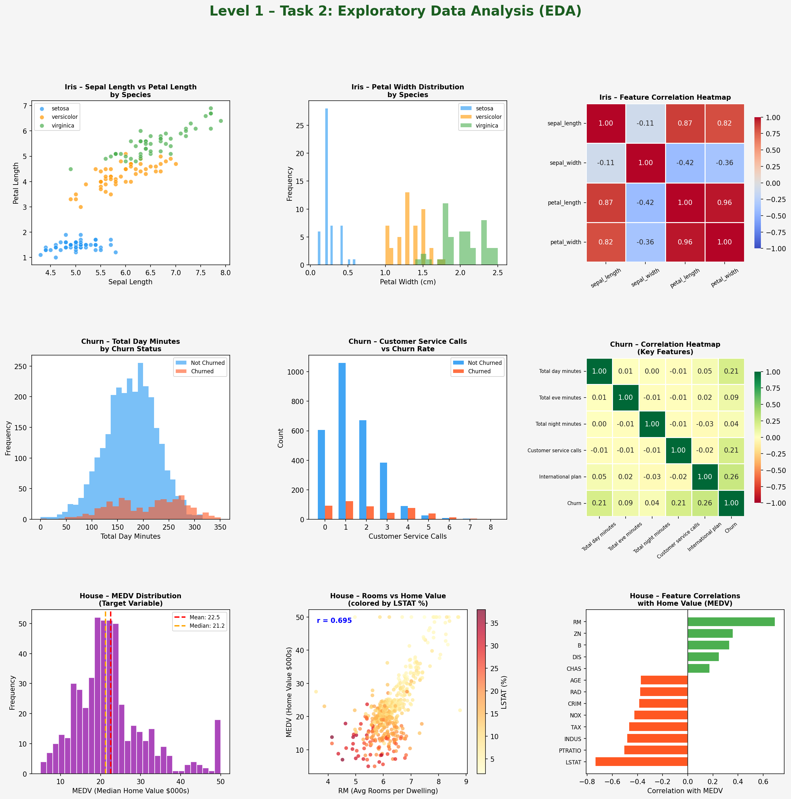
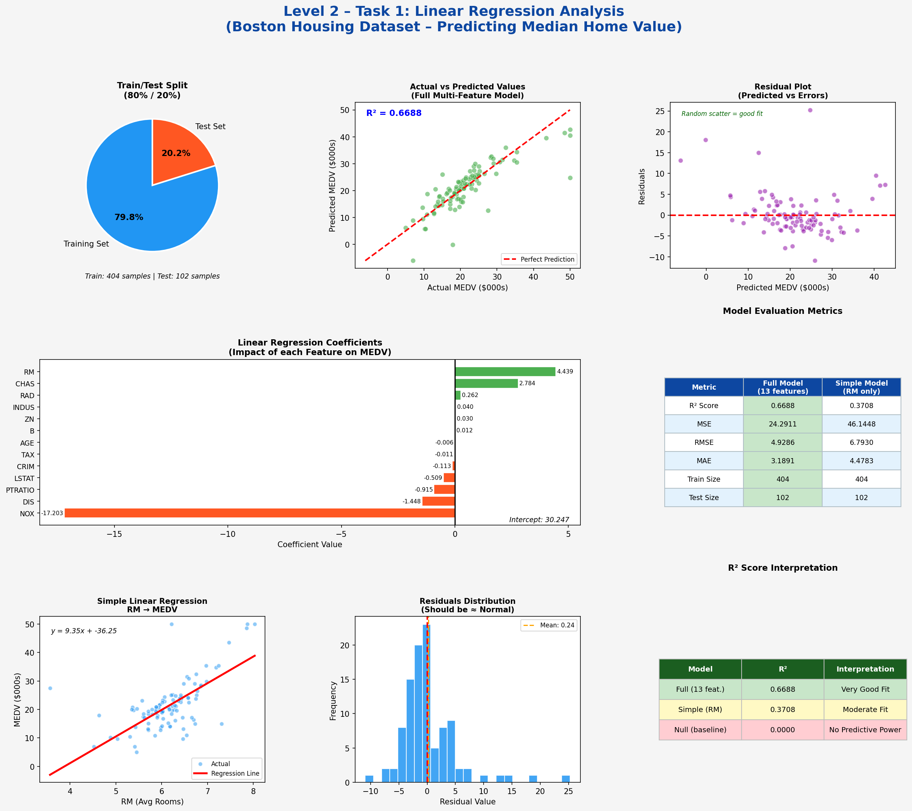
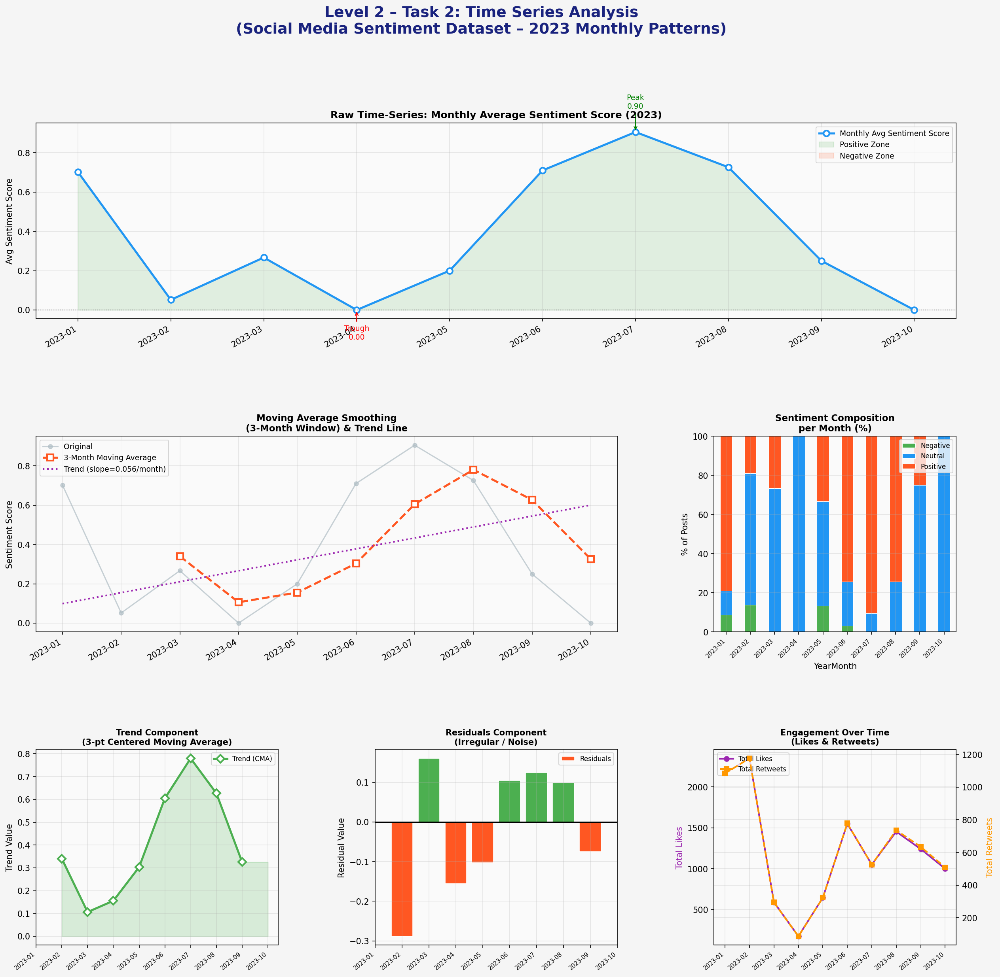

# Codveda Data Science Internship

## Overview
This repository contains all completed tasks for the Codveda Data Science Internship.

## Tasks Completed

### Level 1 – Task 1: Data Cleaning & Preprocessing
- Missing value detection and handling
- Duplicate removal
- Outlier detection using IQR method
- Label encoding of categorical variables
- Min-Max feature scaling

### Level 1 – Task 2: Exploratory Data Analysis (EDA)
- Descriptive statistics
- Feature correlation heatmaps
- Distribution plots by category
- Churn rate and engagement analysis

### Level 2 – Task 1: Regression Analysis
- Train/test split (80/20)
- Linear Regression using scikit-learn
- Coefficient interpretation
- Evaluation: R² = 0.6688, RMSE = 4.93

### Level 2 – Task 2: Time Series Analysis
- Monthly sentiment trend plotting
- Moving average smoothing (3-month window)
- Manual trend and residual decomposition
- Engagement (Likes & Retweets) over time

## Datasets Used
| Dataset | Task |
|---|---|
| Iris | Cleaning, EDA |
| Churn (BigML) | Cleaning, EDA |
| Boston Housing | Regression |
| Social Media Sentiment | Time Series |

## Tools & Libraries
Python, pandas, numpy, matplotlib, seaborn, scikit-learn

## Visualizations

